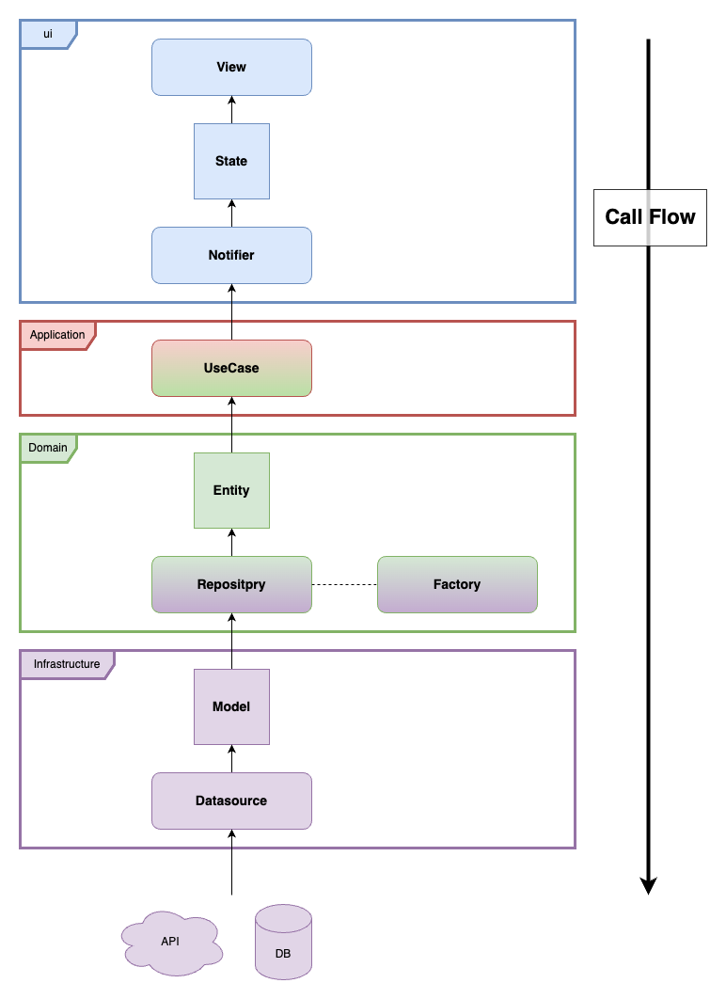

# zinjanow

## Overview

I wanted to create something for learning, so I created this application in flutter. It is said that there are about three times as many Shinto shrines and Buddhist temples in Japan as there are convenience stores. This application uses Google Map API to search for shrines within a certain distance from your current location. The searched shrines can be registered as favorites, and if you visit the shrine, you can record your visit (check-in) to the shrine. <br />

## Technologies and Services Used

・flutter <br />
・supabase <br />
・Google Map API<br />

## Architecture


## Directory

```
lib/
├── core/
│   ├── exception/
│   ├── extention/
│   └── utils/
├── domain/
│   ├── entity/
│   ├── factory/
│   ├── repository/
│   ├── usecase/
│   └── value/
├── application/
│   └── usecase/
├── infrastructure/
│   ├── datasource/
│   ├── model/
│   ├── factory/
│   └── repository/
├── ui/
│   ├── notify
│   ├── state
│   └── view/
│       ├── components
│       ├── pages
│       └── validation
└── main.dart
```
## List of Functions

・Login <br />
　　・Email and Password <br />
　　・Google Account <br />
・Sign up <br />
　　・Email and Password <br />
・Search shrines from your location <br />
・Route indication to the shrine <br />
・Add shrine to favorites  <br />
・Add Visit History (check-in) <br />
・Follow each other account <br />
<br />

## Utilized Libraries
<b>supabase_flutter: ^1.10.14</b><br />
https://pub.dev/packages/supabase_flutter<br />
<br />
<b>freezed 2.4.2</b><br />
https://pub.dev/packages/freezed<br />
<br />
<b>freezed_annotation 2.2.0</b><br />
https://pub.dev/packages/freezed_annotation<br />
<br />
<b>flutter_riverpod 2.3.2</b><br />
https://pub.dev/packages/flutter_riverpod<br />
<br />
<b>flutter_dotenv 5.1.0</b><br />
https://pub.dev/packages/flutter_dotenv<br />
<br />
<b>build_runner 2.3.2</b><br />
https://pub.dev/packages/build_runner<br />
<br />
<b>flutter_auth 6.0.2</b><br />
https://pub.dev/packages/flutter_appauth<br />
<br />
<b>crypto 3.0.3</b><br />
https://pub.dev/packages/crypto<br />
<br />
<b>geolocator 10.0.1</b><br />
https://pub.dev/packages/geolocator<br />
<br />
<b>dio 5.3.2</b><br />
https://pub.dev/packages/dio<br />
<br />
<b>carousel_slider 4.2.1</b><br />
https://pub.dev/packages/carousel_slider<br />
<br />
<b>dotted_line 3.2.2</b><br />
https://pub.dev/packages/dotted_line<br />
<br />
<b>flutter_rating_bar 4.0.1</b><br />
https://pub.dev/packages/flutter_rating_bar<br />
<br />
<b>google_map_flutter 2.5.0</b><br />
https://pub.dev/packages/google_maps_flutter<br />
<br />
※ add here<br />
<br />